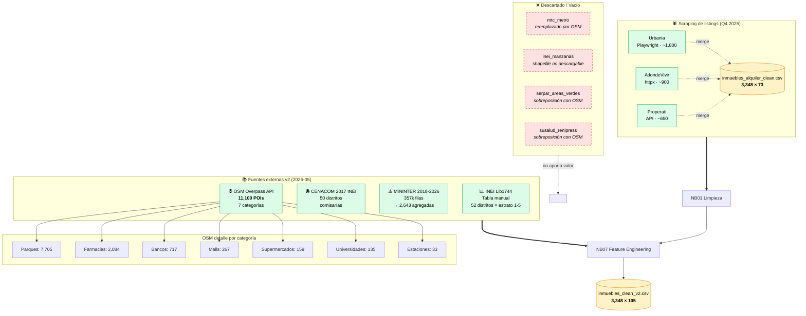
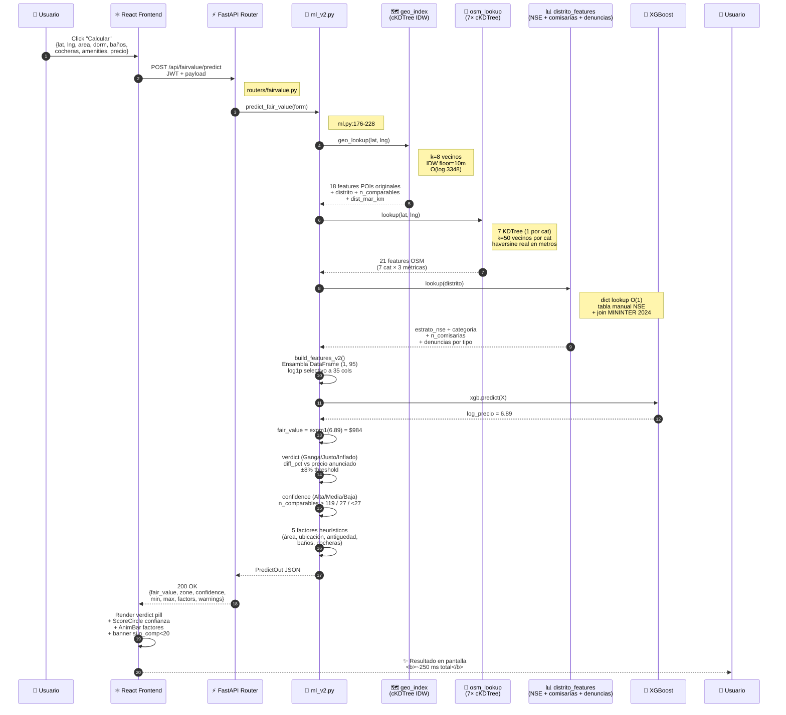
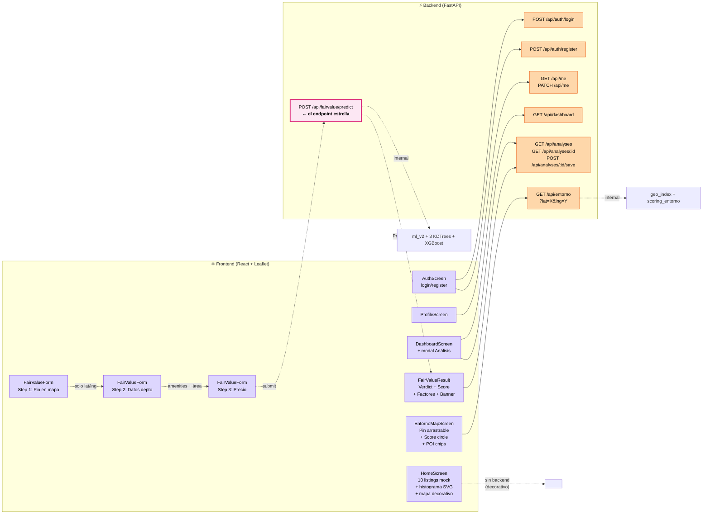

# Diagramas del Proyecto DPD (ubIcA)

> **6 diagramas Mermaid** complementarios que explican el sistema fin-a-fin.
> Cada uno se renderiza directamente en VSCode (Markdown Preview) o GitHub.
> Para exportar a PNG: `npx -p @mermaid-js/mermaid-cli mmdc -i DIAGRAMAS.md -o diagramas/`.
>
> **Para defensa ante el profesor:** los diagramas están pensados para presentarse en este orden — primero el overview, después se hace zoom según preguntas.

---

## Diagrama 1 — Vista general (Overview)

**Para qué sirve:** explicar en 30 segundos las 6 fases del sistema. Empezar la sustentación con este.

```mermaid
flowchart LR
    subgraph A[" 🕷️ A · Adquisición "]
        direction TB
        A1[Web scraping<br/>Urbania + AdondeVivir<br/>+ Properati<br/><b>3,348 listings</b>]
        A2[Fuentes externas:<br/>OSM · CENACOM<br/>MININTER · INEI]
    end

    subgraph B[" 🧹 B · Limpieza + EDA "]
        direction TB
        B1[NB01 — Limpieza<br/>NaN semántico MNAR]
        B2[NB02 — EDA<br/>Skew 3.3 → log1p]
        B3[NB06 — Diagnóstico v2<br/>4 bugs auditados]
    end

    subgraph C[" 🔧 C · Feature Engineering "]
        direction TB
        C1[NB07 — +29 features<br/>NSE + POIs OSM<br/>+ seguridad]
        C2[NB08 — Pipeline<br/>Smoothing k=30<br/>Sample weights 1/√n<br/>Split estratificado]
    end

    subgraph D[" 🤖 D · Entrenamiento "]
        direction TB
        D1[NB09 — Optuna<br/>5 modelos × 20 trials]
        D2[🏆 XGBoost gana<br/>MAE $158 · MAPE 15.74%<br/>R² 0.861]
    end

    subgraph E[" ⚡ E · Backend FastAPI "]
        direction TB
        E1[model_service<br/>+ 3 índices KDTree<br/>+ tabla NSE]
        E2[POST /api/fairvalue/predict<br/>~250 ms]
    end

    subgraph F[" ⚛️ F · Frontend React "]
        direction TB
        F1[Wizard 3 pasos<br/>pin → datos → precio]
        F2[Verdict + Score + Banner<br/>de cobertura honesta]
    end

    A --> B --> C --> D --> E --> F

    classDef adq fill:#dcfce7,stroke:#16a34a,color:#000;
    classDef clean fill:#fef3c7,stroke:#d97706,color:#000;
    classDef fe fill:#dbeafe,stroke:#2563eb,color:#000;
    classDef model fill:#fce7f3,stroke:#db2777,color:#000;
    classDef back fill:#fed7aa,stroke:#ea580c,color:#000;
    classDef front fill:#ddd6fe,stroke:#7c3aed,color:#000;
    class A1,A2 adq;
    class B1,B2,B3 clean;
    class C1,C2 fe;
    class D1,D2 model;
    class E1,E2 back;
    class F1,F2 front;
```



**Talking points si el profe pregunta "¿qué hace tu sistema?":**
- "3,348 listings reales → 95 features de 4 fuentes externas → XGBoost → React"
- "El gap principal es que el mercado limeño está desbalanceado (41% en 2 distritos), por eso usamos sample weighting"
- "Cero data sintética como compromiso ético"

---

## Diagrama 2 — Adquisición de datos (Fase A)

**Para qué sirve:** mostrar de dónde sale CADA dato. Si el profe pregunta "¿qué fuentes usaron?", apuntás a este diagrama.



**Talking points:**
- "4 fuentes externas REALES, cero data sintética"
- "Descartamos 4 fuentes que no aportaban: las documentamos para honestidad"
- "OSM concentra 11,100 POIs, mayormente parques (70%)"

---

## Diagrama 3 — Pipeline ML completo (Fases B-D)

**Para qué sirve:** explicar el proceso de notebooks. Si el profe pregunta "¿qué técnicas de feature engineering usaron?", este es el diagrama.

```mermaid
flowchart TB
    RAW[(inmuebles_alquiler_clean.csv<br/>3,348 × 73)]

    RAW --> NB01

    subgraph NB01[" NB01 — Limpieza "]
        L1[NaN amenities Properati<br/>≠ 0 → MNAR]
        L2[NaN cocheras<br/>≠ 0 cocheras]
        L3[Imputar antigüedad<br/>mediana grouped<br/>distrito × tipo]
    end

    NB01 --> CLEAN1[(inmuebles_clean_v1.csv<br/>3,348 × 75)]
    CLEAN1 --> NB02 & NB06

    subgraph NB02[" NB02 — EDA "]
        E1[Skew = 3.31<br/>→ log1p del target]
        E2[Heatmap correlación]
        E3[Outliers detectados]
    end

    subgraph NB06[" NB06 — Diagnóstico v2 "]
        D1[5 casos stress<br/>La Planicie, Casuarinas...]
        D2[4 bugs cerrados:<br/>matriz NB05 invertida<br/>mismatch 74-vs-77<br/>caps huérfano<br/>features fantasma]
    end

    NB02 --> NB07
    NB06 --> NB07

    subgraph NB07[" NB07 — Features geográficos "]
        F1[Familia 1: NSE<br/>4 cols]
        F2[Familia 2: POIs OSM<br/>7 cat × 3 métricas<br/>= 21 cols]
        F3[Familia 3: Seguridad<br/>4 cols]
    end

    NB07 --> CLEAN2[(inmuebles_clean_v2.csv<br/>3,348 × 105)]
    CLEAN2 --> NB08

    subgraph NB08[" NB08 — Pipeline v2 "]
        P1[Bayesian smoothing<br/>k=30 en target encoder]
        P2[Sample weights<br/>1/√count_distrito<br/>La Molina 3.51× Miraflores]
        P3[Split estratificado<br/>categoría × estrato_nse]
        P4[Outlier caps p99<br/>train → val+test]
        P5[log1p selectivo<br/>35 features skew > 1]
        P6[Filtro correlación<br/>107 → 95 features]
    end

    NB08 --> NB09

    subgraph NB09[" NB09 — Entrenamiento Optuna "]
        M1[Linear Regression]
        M2[Ridge α=1.0]
        M3[Lasso α=1e-3]
        M4[Random Forest<br/>n=176 depth=17]
        M5[<b>XGBoost</b><br/>n=489 depth=11<br/>lr=0.039]
    end

    NB09 --> WIN[🏆 XGBoost<br/>MAE $158 · MAPE 15.74%<br/>R² 0.861 · RMSE $284]

    WIN --> ART[(models/v2/<br/>modelo_final_v2.joblib<br/>+ scaler + encoder<br/>+ outlier_caps<br/>+ feature_names)]

    ART --> NB10

    subgraph NB10[" NB10 — Comparativa v1 vs v2 "]
        C1[14 distritos mejoran<br/>3 empeoran]
        C2[La Molina sobrepredice<br/>limitación de DATA<br/>no del modelo]
    end

    classDef nb fill:#dbeafe,stroke:#2563eb,color:#000;
    classDef data fill:#fef3c7,stroke:#d97706,color:#000;
    classDef winner fill:#fce7f3,stroke:#db2777,color:#000,stroke-width:3px;
    class NB01,NB02,NB06,NB07,NB08,NB09,NB10 nb;
    class RAW,CLEAN1,CLEAN2,ART data;
    class WIN,M5 winner;
```



**Talking points:**
- "Aplicamos Bayesian smoothing (paper FB He et al. 2014, U3_T2 slide 5)"
- "Sample weighting es la adaptación a regresión del Class-balanced loss del slide 24"
- "Split estratificado es más exigente que el `train_test_split` random del slide 39"
- "El log1p de skew>1 son 35 features (no 18 como dijimos antes — corregido tras auditoría)"

---

## Diagrama 4 — Anatomía de UNA predicción (Sequence)

**Para qué sirve:** mostrar QUÉ pasa cuando el usuario clickea "Calcular". Si el profe pregunta "¿cómo funciona la inferencia en producción?", este.



**Talking points:**
- "El startup carga TODO en memoria: el modelo + 3,348 listings (KDTree) + 11,100 POIs (7 KDTree) + tabla NSE. Después de eso, cada predicción es O(log N)."
- "El backend devuelve `predicted_in_seconds` en cada respuesta — auditable"
- "Los factores son **heurísticas para el usuario final**, NO son SHAP. Esto es el GAP que identificó la auditoría (U4_T2 slide 65 enseña DiCE)."

---

## Diagrama 5 — Arquitectura del Backend (Fase E)

**Para qué sirve:** mostrar la estructura de servicios del backend. Útil si el profe pregunta "¿cómo organizaron el código?".

```mermaid
flowchart TB
    subgraph STARTUP["🚀 Startup del backend (1 vez)"]
        MS[model_service.load<br/>USE_V2 = exists(modelo_final_v2.joblib)<br/>and not DPD_FORCE_V1]
        GI[GeoIndex(geo_index.csv)<br/>3,348 listings<br/>1 cKDTree global]
        OI[OSMIndex()<br/>11,100 POIs<br/>7 cKDTree por categoría]
        DI[DistritoFeatures()<br/>Join NSE + CENACOM + MININTER<br/>52 distritos en RAM]
    end

    subgraph REQUEST["📥 Por cada request (250 ms)"]
        direction TB
        R1[POST /api/fairvalue/predict]
        R2[GET /api/entorno?lat=X&lng=Y]

        subgraph PIPE["build_features_v2"]
            direction LR
            P1[Estructurales<br/>area, dorm, baños...]
            P2[Geo IDW<br/>geo_index.lookup]
            P3[POIs OSM<br/>osm.lookup]
            P4[NSE + Seguridad<br/>distrito_features.lookup]
            P5[Derivadas<br/>area_x_amenities, etc.]
            P6[log1p × 35 cols]
            P7[(DataFrame<br/>1 × 95)]
            P1 --> P2 --> P3 --> P4 --> P5 --> P6 --> P7
        end

        R1 --> PIPE
        PIPE --> PRED[xgb.predict<br/>→ log_y<br/>→ expm1<br/>→ fair_value USD]
        PRED --> VRD[Verdict ±8%<br/>+ Confidence<br/>+ Factors heurísticos]
    end

    subgraph SCORE["GET /api/entorno (separado)"]
        S1[geo_index.lookup]
        S2[scoring_entorno<br/>security = 100 - pct_den × 80<br/>services = 30 + pct_poi × 68<br/>score = 0.5·sec + 0.5·serv]
        S3[level:<br/>≥80 Excelente<br/>≥65 Bueno<br/>≥50 Regular<br/><50 Riesgo]
        R2 --> S1 --> S2 --> S3
    end

    MS -.carga.-> PRED
    GI -.lookup.-> P2
    GI -.lookup.-> S1
    OI -.lookup.-> P3
    DI -.lookup.-> P4

    DB[(SQLite<br/>justa.db<br/>users + analyses)]
    R1 -.guarda.-> DB

    classDef startup fill:#fce7f3,stroke:#db2777,color:#000;
    classDef req fill:#dbeafe,stroke:#2563eb,color:#000;
    classDef pipe fill:#fef3c7,stroke:#d97706,color:#000;
    classDef score fill:#dcfce7,stroke:#16a34a,color:#000;
    class MS,GI,OI,DI startup;
    class R1,R2,PRED,VRD req;
    class P1,P2,P3,P4,P5,P6,P7,PIPE pipe;
    class S1,S2,S3,SCORE score;
```

**Talking points:**
- "Singleton lazy loading: cada índice se construye 1 vez al primer request o startup"
- "Los 3 índices KDTree + tabla NSE son nuestro Feature Store ligero (U4_T1 slide 8)"
- "El switch v1/v2 vive en `model_service.mode` — ningún endpoint sabe qué modelo está activo"

---

## Diagrama 6 — Frontend ↔ Backend (Fase F)

**Para qué sirve:** mostrar QUÉ pantalla llama QUÉ endpoint. Útil si el profe pregunta "¿cómo se integra el modelo con la UI?".



**Endpoints totales: 10** (3 auth/me + 3 analyses + 1 dashboard + 1 predict + 1 entorno + 1 me PATCH).

**Talking points:**
- "El frontend no tiene lógica de modelo. Toda la inteligencia vive en el backend."
- "FairValueResult NO calcula nada — solo renderiza lo que devuelve el predict."
- "EntornoMapScreen es la única pantalla que tiene un pin arrastrable y recalcula en vivo: cada drag dispara un GET /api/entorno."
- "El login viene pre-rellenado con `ana@ubica.pe` / `demo1234` para demo rápido."

---

## Cómo exportar a PNG (si los necesitas para slides)

```bash
# instala mermaid-cli una vez
npm install -g @mermaid-js/mermaid-cli

# extrae cada diagrama del .md a su propio .mmd + .png
cd /Users/alejandromarcelo/Desktop/PROYECTOS_2026/Proyecto_DPD
mkdir -p diagramas
# (proceso manual: copia cada bloque ```mermaid a diagramas/01_overview.mmd etc.)
mmdc -i diagramas/01_overview.mmd -o diagramas/01_overview.png -w 1920 -H 1080
```

O **abrí este archivo en VSCode con Markdown Preview** (`Cmd+Shift+V`) y ya los ves renderizados.

---

## Cómo recorrerlos en la sustentación (script sugerido, ~5 min)

1. **(30s) Diagrama 1 — Overview**: "El sistema tiene 6 fases. Lo voy a recorrer."
2. **(45s) Diagrama 2 — Adquisición**: "4 fuentes externas reales, cero data sintética. Estos 4 los descartamos porque..."
3. **(60s) Diagrama 3 — Pipeline ML**: "Aplicamos Bayesian smoothing del paper de Facebook, sample weighting como adaptación de Class-balanced loss del curso, split estratificado. Optuna eligió XGBoost."
4. **(60s) Diagrama 4 — Anatomía de una predicción**: "En producción, una predicción toma 250 ms: 3 lookups O(log N) + 1 inferencia XGBoost + 1 render."
5. **(45s) Diagrama 5 — Backend**: "Los 3 índices KDTree son nuestro Feature Store ligero."
6. **(30s) Diagrama 6 — Frontend↔Backend**: "10 endpoints. El estrella es el predict."
