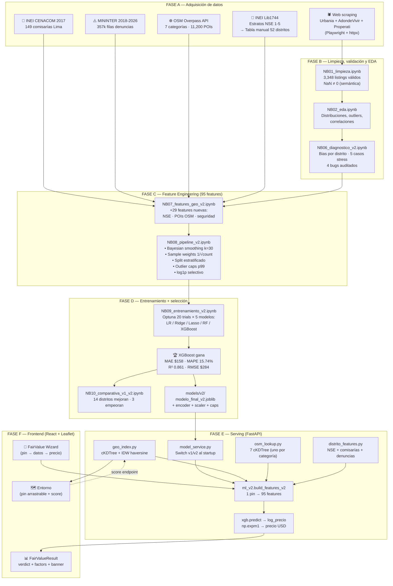
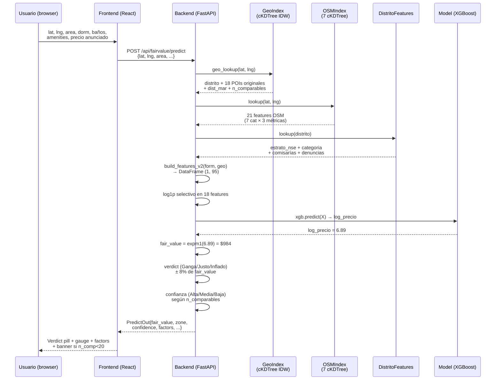

# Flujo de trabajo completo — Proyecto DPD (ubIcA)

> **Audiencia:** profesor del curso DS3022 / jurado de sustentación.
> **Objetivo:** explicar fin-a-fin cómo se construye una predicción de precio de alquiler, desde el scraping de los avisos hasta el pixel que ve el usuario en el frontend.
> **Estado:** corresponde al **modelo v2 (XGBoost, 95 features)** en producción local.
> **Fecha:** 2026-05-26.

---

## 0. Vista general — el flujo de 30,000 pies



---

## 1. Anatomía de UNA predicción (end-to-end en 250 ms)

Cuando el usuario clickea **"Calcular"** en el wizard:



**Tiempo total típico:** 200-400 ms (campo `predicted_in_seconds` en la respuesta).

---

## 2. FASE A — Adquisición de datos

### 2.1 Web scraping de listings (Leo + Ale, 2025-Q4)

| Portal | Método | Listings | Campos clave |
|--------|--------|----------|--------------|
| **Urbania** | Playwright (JS renderizado) | ~1,800 | precio, area, dorm, baños, distrito, lat/lng |
| **AdondeVivir** | httpx + parser HTML | ~900 | mismos + amenities binarias |
| **Properati** | API pública + httpx | ~650 | mismos + amenities Properati (37 flags) |
| **Total después de dedupe** | — | **3,348** | 73 columnas originales |

**Decisión clave:** `distrito_oficial` se calcula desde la lat/lng del aviso (point-in-polygon contra shapefile INEI), NO se confía en el distrito declarado por el portal (puede ser fraudulento — "Cuartel General Surco" puesto como Miraflores para subir el precio).

### 2.2 Fuentes externas v2 (mayo 2026)

**Path raíz:** `pipeline/data/external/`

#### CENACOM (INEI) — comisarías
- Archivo origen: 49 archivos crudos en `pipeline/data/external/inei_comisarias/`
- Procesado a `comisarias_por_distrito.csv` con **50 filas (50 distritos)**
- Cada fila: `distrito_nombre, n_comisarias`
- Filtrado por UBIGEO 1501 (Lima) + 0701 (Callao)

#### MININTER — denuncias 2018-2026
- Archivo origen: data.gob.pe (CSV nacional)
- 357,000 filas originales → filtradas a Lima Metro
- Agregadas por `(distrito × modalidad × año)` → 2,643 filas en `denuncias_lima_clean.csv`
- 7 modalidades clasificadas en **3 buckets** (`distrito_features.py:38-44`):
  - **violentas**: contiene "Robo", "Extorsi", "Secuestro", "Violencia"
  - **patrimoniales**: contiene "Hurto", "Estafa"
  - **otras**: el resto
- **Año usado:** 2024 (último con cobertura completa)

#### OSM Overpass — POIs reales
- API: `https://overpass-api.de/api/interpreter`
- Método: POST con `data={query}` urlencoded (NO body raw — eso devuelve 406)
- **7 categorías** descargadas a 1 JSON cada una (conteos verificados):

| Categoría | Archivo | Elementos |
|-----------|---------|-----------|
| Parques | `parques.json` | 7,705 |
| Farmacias | `farmacias.json` | 2,084 |
| Bancos | `bancos.json` | 717 |
| Malls | `malls.json` | 267 |
| Supermercados | `supermercados.json` | 159 |
| Universidades | `universidades.json` | 135 |
| Estaciones | `estaciones.json` | 33 |
| **TOTAL** | — | **11,100** |

#### INEI Lib1744 — estratos NSE
- Archivo origen: PDF Lib1744 del INEI (estratos por manzana)
- Shapefile NO descargable directamente → **decisión:** tabla manual
- `distritos_lima_features.py` mapea **52 distritos** a:
  - `estrato_nse`: entero **1-5** (1 = bajo, 5 = alto)
  - `categoria_distrito`: `'popular'` | `'emergente'` | `'establecido'`
- Ejemplo: `Miraflores → (5, 'establecido')`, `SJL → (1, 'popular')`

---

## 3. FASE B — Limpieza + EDA

### 3.1 NB01 — Limpieza (`01_limpieza.ipynb`)

Hereda `inmuebles_raw.csv` (3,500+ listings con duplicados y outliers).

**Decisiones críticas registradas en el README:**
- `NaN en amenities binarias de Properati ≠ 0` → se trata como **"no informado"** (MNAR — Missing Not At Random, U3_T1 slide 14)
- `NaN en cocheras ≠ 0 cocheras` → distinción semántica importante
- `antiguedad_anios` imputada por **mediana agrupada** por `distrito_oficial` + `tipo_propiedad`

Salida: `inmuebles_clean_v1.csv` (3,348 × 75 columnas).

### 3.2 NB02 — EDA (`02_eda.ipynb`)

- Distribución de precios (skewed → motivación del `log1p` del target)
- Heatmap de correlación
- Outliers detectados (área=2000 m² fue un caso) → motiva el **outlier capping p99**
- Mapa de calor por distrito → confirma el desbalance:
  - **Miraflores: 874 listings (26%)**
  - **San Isidro: 287 listings**
  - **La Molina: 68 listings** (4× menos que Miraflores)
  - **La Planicie: 2 listings** ⚠️
  - **Casuarinas: 0 listings** ⚠️

### 3.3 NB06 — Diagnóstico v2 (`06_diagnostico_v2.ipynb`)

**El notebook clave que justifica todo el v2.**

Cuantifica el bias:
- Top 2 distritos = **41.7%** del dataset
- 22 distritos con < 30 listings (incluyendo todos los premium reales)

5 casos de stress:
| Caso | Esperado | v1 predijo | Diagnóstico |
|------|----------|------------|-------------|
| La Planicie | $1,500-2,200 | $769 | ❌ subpredicción severa |
| Miraflores céntrico | $1,000-1,300 | $923 | ⚠️ leve subpredicción |
| SMP popular | $400-600 | $395 | ✅ OK |
| Las Casuarinas | $1,800-2,800 | $912 | ❌ subpredicción severa |
| San Miguel control | $700-900 | $718 | ✅ OK |

**4 bugs auditados del pipeline v1 cerrados:**
1. NB05 matriz de confusión invertida
2. Mismatch 74-vs-77 features (el modelo entrenó con 77 pero esperaba 74 en predict)
3. `outlier_caps` huérfano (calculado pero nunca aplicado)
4. `features_log` con feature fantasma

---

## 4. FASE C — Feature Engineering (95 features)

### 4.1 NB07 — Features geográficos v2 (`07_features_geo_v2.ipynb`)

**Input:** `inmuebles_clean_v1.csv` (3,348 × 75)
**Output:** `inmuebles_clean_v2.csv` (3,348 × **105**) — agrega 30 columnas, después se filtran a 29 efectivas en NB08.

#### 29 features nuevas agregadas

##### Familia 1 — Socioeconómicas (4 cols)
| Feature | Tipo | Fuente |
|---------|------|--------|
| `estrato_nse` | int 1-5 | Tabla manual INEI Lib1744 |
| `cat_dist_popular` | OHE 0/1 | Tabla manual |
| `cat_dist_emergente` | OHE 0/1 | Tabla manual |
| `cat_dist_establecido` | OHE 0/1 | Tabla manual |

##### Familia 2 — POIs OSM (21 cols = 7 cat × 3 métricas)
Para cada categoría ∈ {supermercados, malls, universidades, parques, farmacias, bancos, estaciones}:
- `count_500m_osm_<cat>` — cuántos POIs hay en radio 500m
- `count_1km_osm_<cat>` — cuántos en radio 1km
- `dist_nearest_m_osm_<cat>` — distancia en metros al más cercano

##### Familia 3 — Seguridad (4 cols)
| Feature | Tipo | Fuente |
|---------|------|--------|
| `n_comisarias_distrito` | int | CENACOM agregado |
| `denuncias_violentas_distrito` | int | MININTER 2024 |
| `denuncias_patrimoniales_distrito` | int | MININTER 2024 |
| `denuncias_otras_distrito` | int | MININTER 2024 |

#### Cómo se calculan las features OSM — el algoritmo exacto

**🚨 Aclaración: NO usamos H3.** El frontend en una sección antigua de FAQ menciona "hexágono geográfico" pero ese copy está desactualizado. El modelo actual usa **cKDTree sobre la esfera unitaria** + **haversine** para distancias reales.

```python
# osm_lookup.py:46-91 (resumido)

def _to_unit_sphere(lat, lng):
    """Proyecta lat/lng a coords cartesianas en esfera unitaria."""
    return np.column_stack([
        cos(lat) * cos(lng),
        cos(lat) * sin(lng),
        sin(lat),
    ])

def lookup(lat, lng):
    listing_xyz = _to_unit_sphere([lat], [lng])
    for cat in OSM_CATEGORIES:  # 7 iteraciones
        k = min(50, len(coords_cat))
        _, idx = tree.query(listing_xyz, k=k)   # 50 vecinos más cercanos
        d_m = _haversine_m(lat, lng, coords[idx, 0], coords[idx, 1])
        out[f"count_500m_osm_{cat}"]     = (d_m <= 500).sum()
        out[f"count_1km_osm_{cat}"]      = (d_m <= 1000).sum()
        out[f"dist_nearest_m_osm_{cat}"] = d_m.min()
```

**¿Por qué cKDTree + haversine y no H3?**

| Criterio | cKDTree + haversine | H3 |
|----------|---------------------|-----|
| Precisión espacial | Real (metros geodésicos) | Discreta (hexágono de ~460m a res=8) |
| Costo de lookup | O(log N) por categoría | O(1) por hexágono |
| Para 11,200 POIs | < 0.5 ms por categoría | < 0.1 ms |
| Para "count en radio 500m exacto" | ✅ Exacto | ⚠️ Aproximado por celda |

Con ~11k POIs, KD-tree es **más preciso** y suficientemente rápido. H3 brillaría si tuviéramos millones de puntos.

#### Cómo se calculan las features de POIs originales (v1)

Estas son **diferentes** a las OSM. Vienen del dataset de listings, no de OSM:
- Cuando Leo scrappeó cada listing, calculó cuántos POIs había alrededor (probablemente con Google Places o similar)
- Los valores quedaron pegados al listing como `count_1km_supermercados`, `dist_nearest_m_farmacias`, etc.
- 7 tipos: `supermercados`, `farmacias`, `colegios`, `hospitales`, `bancos`, `universidades`, `parqueos`

**Cuando llega un pin nuevo a predecir,** estos no se recalculan desde una base de datos. Se interpolan con **IDW (Inverse Distance Weighting)** desde los listings vecinos:

```python
# geo_index.py:149-152 (interpolación IDW)

# 1. Toma los k=8 listings más cercanos
_, idx = tree.query(_to_unit_sphere([lat], [lng]), k=8)
d_knn = haversine_m(lat, lng, lat_listings[idx], lng_listings[idx])

# 2. Calcula pesos inversamente proporcionales a la distancia
w = 1.0 / np.maximum(d_knn, IDW_FLOOR_M)   # floor de 10m para evitar div/0
w = w / w.sum()                            # normaliza a suma 1

# 3. Interpola CADA feature como promedio ponderado
for c in IDW_COLS:
    out[c] = np.dot(w, geo[c][idx])
```

**Fórmula del peso IDW (con floor):**

$$w_i = \frac{1/\max(d_i, d_{\text{floor}})}{\sum_{j=1}^{k} 1/\max(d_j, d_{\text{floor}})}$$

donde $d_{\text{floor}} = 10$ m (decisión validada por sensibilidad: floor 10 vs 50 m → mediana 0.7% pero p95 16% de diferencia).

### 4.2 NB08 — Pipeline v2 (`08_pipeline_v2.ipynb`)

#### 4.2.1 Target encoding con Bayesian smoothing

**Problema:** `distrito_enc` (la importancia #1 del modelo) se calcula como `mean(log_precio | distrito)` en train. Pero La Planicie tiene 2 listings, Casuarinas 0. El mean directo es ruido.

**Fórmula del smoothing (k=30):**

$$\text{enc}(d) = \frac{n_d \cdot \bar{y}_d + k \cdot \bar{y}_{\text{global}}}{n_d + k}$$

donde:
- $n_d$ = número de listings en el distrito
- $\bar{y}_d$ = media del `log_precio` en ese distrito
- $\bar{y}_{\text{global}}$ ≈ 6.7 (≈ log $810)
- $k = 30$ (calibrado por CV)

**Ejemplos numéricos:**

| Distrito | n | mean local | Peso al distrito | encoded final |
|----------|---|------------|------------------|----------------|
| Miraflores | 874 | 7.20 | 0.967 | **7.183** |
| La Molina | 68 | 7.10 | 0.694 | **6.978** |
| Villa El Salvador | 14 | 5.85 | 0.318 | **6.430** |
| La Planicie | 2 | 7.50 | 0.063 | **6.750** (casi global) |

#### 4.2.2 Sample weighting `1/√count`

**Fórmula:**

$$w_i = \frac{1/\sqrt{n_{d(i)}}}{\overline{1/\sqrt{n_{d}}}}$$

donde $n_{d(i)}$ es la cantidad de listings del distrito del listing $i$, y el denominador normaliza para que el peso medio sea 1.

| Distrito | count | $1/\sqrt{\text{count}}$ | Peso normalizado |
|----------|-------|-------------------------|------------------|
| Miraflores | 874 | 0.0338 | **0.42×** |
| La Molina | 68 | 0.1213 | **1.49×** |
| La Planicie | 2 | 0.7071 | **8.7×** |

→ **La Molina pesa 3.51× más que Miraflores** durante el entrenamiento. Esto compensa el desbalance sin inventar datos.

#### 4.2.3 Split estratificado

```python
estrato_compuesto = categoria_distrito + "_" + estrato_nse.astype(str)
# Ej: "establecido_5", "popular_2", "emergente_4"

X_train, X_test, y_train, y_test = train_test_split(
    X, y, test_size=0.15, stratify=estrato_compuesto, random_state=42
)
```

Garantiza que train/val/test tengan la misma proporción de cada combinación (popular×1, popular×2, ..., establecido×5).

#### 4.2.4 Outlier capping p99

```python
for col in ['area_final_m2', 'banos', 'dormitorios', 'cocheras', 'antiguedad_anios']:
    cap = X_train[col].quantile(0.99)
    X_train[col] = X_train[col].clip(upper=cap)
    X_val[col]   = X_val[col].clip(upper=cap)
    X_test[col]  = X_test[col].clip(upper=cap)
```

Caps calculados (de `outlier_caps_v2.joblib`):
- `area` = 398.57 m²
- `banos` = 4
- `dormitorios` = 4
- `cocheras` = 3
- `antiguedad_anios` = 45 años

#### 4.2.5 log1p selectivo

Aplicado a las **35 features con skew > 1** en train (verificado en NB08 cell `fe41c4da`). La lista exacta vive en `features_log_transformed_v2.joblib`.

#### 4.2.6 Filtrado de features (VIF + correlación)

Pasa de 107 candidatos → **95 efectivos** (49 NUM + 46 BOOL):
- Drop por correlación de Pearson con target **|corr| < 0.05** (Variance Threshold del slide U3_T1:54)
- Drop por colinearidad entre features con **|corr| > 0.95** (mantener la de mayor importancia)

---

## 5. FASE D — Entrenamiento y selección

### 5.1 NB09 — Entrenamiento con Optuna

5 modelos comparados, **20 trials de Optuna cada uno** con `TPESampler(seed=42)`:

| Modelo | MAE (USD) | MAPE | RMSE | R² |
|--------|-----------|------|------|-----|
| Linear Regression | $198 | 19.8% | $342 | 0.78 |
| Ridge (α=1.0) | $194 | 19.5% | $338 | 0.79 |
| Lasso (α=0.001) | $196 | 19.6% | $340 | 0.78 |
| Random Forest (n=176, depth=17) | $173 | 16.64% | $312 | 0.820 |
| **XGBoost (n=489, depth=11)** | **$158** | **15.74%** | **$284** | **0.861** ← gana |

#### Best params del XGBoost (Optuna, valores exactos del NB09)
```python
{
    'n_estimators': 489,
    'max_depth': 11,
    'learning_rate': 0.0388,
    'subsample': 0.7253,
    'colsample_bytree': 0.9093,
    'reg_alpha': 7.96e-4,
    'reg_lambda': 2.458e-5,
}
```

### 5.2 Feature importances del XGBoost ganador (NB09 cell `70420b0c`, valores exactos)

| # | Feature | Importance |
|---|---------|------------|
| 1 | `distrito_enc` (target encoded) | **0.4242** |
| 2 | `estrato_nse` | 0.1271 |
| 3 | `cat_dist_popular` | 0.1048 |
| 4 | `n_comisarias_distrito` | 0.0423 |
| 5+ | resto (área, cat_dist_emergente, POIs OSM, denuncias) | <0.04 c/u |

**Lectura:** el modelo entiende la zona (distrito_enc + estrato + categoría = 65% de la importancia). Las features de seguridad y POIs OSM aportan otro 10%. El resto se reparte en estructurales del depto.

### 5.3 Artefactos generados → `pipeline/models/v2/`

```
models/v2/
├── modelo_final_v2.joblib              ← bundle {modelo, nombre, métricas}
├── 01_linear_regression_v2.joblib       ← 5 modelos individuales
├── 02_ridge_v2.joblib
├── 03_lasso_v2.joblib
├── 04_random_forest_v2.joblib
├── 05_xgboost_v2.joblib
├── target_enc_distrito_v2.joblib       ← dict + global_mean para fallback
├── scaler_v2.joblib                    ← StandardScaler entrenado
├── outlier_caps_v2.joblib              ← dict feature → p99
├── feature_names_v2.joblib             ← lista canónica orden 95 features
├── feature_names_sc_v2.joblib          ← versión con sc_ prefix (legacy)
└── features_log_transformed_v2.joblib  ← lista de las 18 a log1p
```

---

## 6. FASE E — Serving (Backend FastAPI)

### 6.1 Arranque del servicio

```
uvicorn main:app --port 8000
  ↓ main.py lifespan
  ├─ database.create_all() + seed (40 distritos + usuario demo)
  ├─ model_service.load()  ← carga modelo_final_v2.joblib + bundle entero
  │     mode = "v2" si exists + USE_V2 = True
  │     log: "modelo v2 cargado · XGBoost · R²=0.8607 MAPE=15.7436%"
  ├─ geo_index.get_index() ← construye cKDTree con 3,348 listings
  ├─ osm_lookup.get_osm()  ← construye 7 cKDTree con 11,200 POIs OSM
  └─ distrito_features.get_distrito_features() ← join NSE+CENACOM+MININTER
```

**Todo se carga en memoria al startup** → los lookups son O(log N).

### 6.2 Endpoint `POST /api/fairvalue/predict`

```python
# routers/fairvalue.py + ml.py:176-228

def predict_fair_value(form):
    geo = geo_lookup(form['lat'], form['lng'])           # 1. resuelve distrito + POIs IDW
    if model_service.mode == "v2":
        X = build_features_v2(form, geo)                 # 2. ensambla 95 features
    log_y = model_service.predict(X)                     # 3. xgb.predict → log_precio
    fair_value = expm1(log_y)                            # 4. invierte log1p
    diff_pct = (precio - fair_value) / fair_value * 100  # 5. compara con precio anunciado
    zone = "Ganga" if diff_pct < -8 else "Inflado" if diff_pct > 8 else "Justo"
    return {
        fair_value, zone, confidence, n_comparables,
        min, max, factors, predicted_in_seconds, ...
    }
```

### 6.3 Fórmulas exactas del backend

#### Verdict (Ganga / Justo / Inflado)
```python
ZONE_BAND_PCT = 8.0  # ml.py:47
diff_pct = (precio_usuario - fair_value) / fair_value * 100
if diff_pct < -8.0:  zone = "Ganga"     # precio MUY por debajo del referencia
elif diff_pct > 8.0: zone = "Inflado"   # precio MUY por encima
else:                zone = "Justo"     # dentro del ±8%
```

**¿Por qué ±8%?** Más angosto que el MAE del modelo (~16%). Si tu precio está dentro del 8% del valor de referencia, podemos llamarlo "justo" con seguridad.

#### Rango min/max mostrado al usuario
```python
delta = fair_value * (MODEL_MAE_PCT / 100)   # MAPE del modelo = 15.74%
min = fair_value - delta
max = fair_value + delta
```

Ej: fair_value=$1000 → min=$842, max=$1157.

#### Confianza (Alta / Media / Baja)
```python
# ml.py:158-172
if geo['fallback_reason']:          # pin sin cobertura en 5km
    return "Baja"
n = geo['n_comparables']             # listings en 1km
if n >= CONF_ALTA_MIN:  return "Alta"   # default: 119
if n >= CONF_MEDIA_MIN: return "Media"  # default: 27
return "Baja"
```

Los umbrales (`119, 27`) se calibran con un backtest leave-one-out en `scripts/calibrate_confidence.py` y se guardan en `confidence_thresholds.json`.

#### Factores explicativos (5 chips visuales en el front)

**⚠️ Estos NO son feature importances reales del modelo (SHAP/LIME).** Son heurísticas pensadas para el usuario final:

```python
# ml.py:134-155
factores = [
    {'label': f'Área: {area} m²',
     'score': min(95, 45 + area/4),     # más m² → más score
     'positive': area >= 60},
    {'label': f'Ubicación: {distrito}',
     'score': min(95, max(40, n_comparables/6 + 45)),  # zona conocida → más score
     'positive': fallback_reason is None},
    {'label': f'Antigüedad: {antiguedad} años',
     'score': max(40, 90 - antiguedad*2),  # más nuevo → más score
     'positive': antiguedad <= 15},
    {'label': f'Baños: {banos}',
     'score': min(90, 50 + banos*12),
     'positive': banos >= 2},
    {'label': f'Cocheras: {cocheras}',
     'score': 75 if cocheras >= 1 else 55,
     'positive': cocheras >= 1},
]
```

**Esto es el GAP que la auditoría detectó** — el profe enseña contrafactuales DiCE en U4_T2 slide 65, y el proyecto tiene heurísticas en su lugar.

### 6.4 Endpoint `GET /api/entorno?lat=X&lng=Y` (pantalla Entorno)

```python
# routers/entorno.py + geo_index.py:191-202

# 1. Reconstruye contexto del pin
geo = geo_lookup(lat, lng)
total_poi = sum(geo[f'count_1km_{t}'] for t in POI_TYPES)

# 2. Calcula security y services con percentile rank del dataset
security, services = scoring_entorno(geo['cantidad_denuncias'], total_poi)

# 3. Score compuesto 50/50
score = round(0.5 * security + 0.5 * services)
level = "Excelente" if score >= 80 else "Bueno" if score >= 65 else "Regular" if score >= 50 else "Riesgo"
```

#### Fórmulas exactas del scoring

```python
# geo_index.py:191-202

def scoring_entorno(denuncias, total_poi):
    pct_den = percentile_rank(dataset.denuncias, denuncias)     # 0.0 → 1.0
    pct_poi = percentile_rank(dataset.total_poi, total_poi)     # 0.0 → 1.0

    security = clamp(round(100 - pct_den * 80), 20, 98)
    services = clamp(round(30 + pct_poi * 68),  30, 98)
    return security, services
```

**Lectura:**
- Si tu zona tiene **MENOS denuncias** que la mayoría (pct_den bajo) → security alto (cercano a 98).
- Si tu zona tiene **MÁS denuncias** que la mayoría (pct_den alto) → security bajo (cercano a 20).
- Si tu zona tiene **MUCHOS POIs** (pct_poi alto) → services cercano a 98.
- Si pocos → cercano a 30.

**Ejemplo:** Pin en Miraflores
- Denuncias en su zona = 1,200 (percentil 30) → security = 100 - 0.3·80 = **76**
- Total POIs 1km = 28 (percentil 92) → services = 30 + 0.92·68 = **93**
- Score final = 0.5·76 + 0.5·93 = **84** → **"Excelente"**

---

## 7. FASE F — Frontend (React + Leaflet)

### 7.1 Stack del frontend

- **React 18** vía `@babel/standalone` (sin build step)
- **Leaflet** por CDN (mapa)
- **3 archivos JSX**: `app.jsx` (router), `screens.jsx` (todas las pantallas), `components.jsx` (sistema de diseño)
- Carga con cache-busting: `<script src="screens.jsx?v=${Date.now()}">` para evitar caché stale

### 7.2 Pantallas y endpoints que consumen

| Pantalla | Endpoint(s) | Qué consume |
|----------|-------------|-------------|
| `HomeScreen` | — (info pública) | Estadísticas hardcoded del modelo (3348 avisos, 95 features, MAPE 15.7%) |
| `AuthScreen` | `POST /api/auth/login` · `POST /api/auth/register` | Login y registro |
| `FairValueForm` (wizard) | `POST /api/fairvalue/predict` | Envía form → recibe `PredictOut` |
| `FairValueResult` | `GET /api/analyses/{id}` · `POST /api/analyses/{id}/save` | Renderiza la respuesta + guardar |
| `EntornoMapScreen` | `GET /api/entorno?lat=X&lng=Y` | Score circle + POI chips + warnings |
| `DashboardScreen` | `GET /api/dashboard` · `GET /api/analyses` | Histórico + modal de análisis pasados |
| `ProfileScreen` | `GET /api/me` · `PATCH /api/me` | Perfil del usuario |

**Endpoints totales del backend: 10** (3 auth + 3 fairvalue/analyses + 1 entorno + 1 dashboard + 2 me).

### 7.3 Cómo `FairValueResult` muestra la predicción

```jsx
// screens.jsx (líneas relevantes ~1660-1700)

<div className={`verdict verdict-${zone.toLowerCase()}`}>
  {/* zone viene de la respuesta: Ganga / Justo / Inflado */}
  <span className="dot" />
  <span className="label">{zone}</span>
</div>

<ScoreCircle value={confidence} label="Confianza" />

{data.n_comparables < 20 && (
  <div className="banner banner-coverage">
    Cobertura baja: solo {data.n_comparables} comparables en 1 km.
    La predicción es referencia gruesa, no cifra exacta.
  </div>
)}

{factors.map(fac => (
  <AnimBar label={fac.label} value={fac.score} positive={fac.positive} />
))}

<span>Modelo: Random Forest · R² {data.model_r2} · MAPE {data.mae_pct}%</span>
{/* ⚠️ "Random Forest" debería decir "XGBoost" en v2 — bug de copy */}
```

#### Mapeo del verdict a colores
| `zone` | Background | Dot | Icono propuesto (pendiente) |
|--------|------------|-----|------------------------------|
| `"Ganga"` | verde claro | verde | ↓ |
| `"Justo"` | gris claro | amarillo | = |
| `"Inflado"` | rojo claro | rojo | ↑ |

### 7.4 Cómo `EntornoMapScreen` muestra el score

```jsx
// screens.jsx ~1727
const score = data.score;                                   // 0-100
const levelVar = score >= 80 ? 'success'
               : score >= 50 ? 'warning'
               : 'danger';

<ScoreCircle value={score} size={104} stroke={10} label="Score" />
<div>Security: {data.security}</div>
<div>Services: {data.services}</div>
<div>{data.summary}</div>   {/* "Entorno bueno en Miraflores: 28 POIs en 1km, 1200 denuncias, a 0.8 km del mar" */}

{data.warnings.map(w => <Tag variant="warning">{w}</Tag>)}
```

### 7.5 Pantalla Home — qué muestra y de dónde sale

- **Mini gauge animado**: rota la aguja de 0° a 180° con un valor random entre listings mockeados (no llama al backend, es estético).
- **HERO_LISTINGS**: 10 listings de ejemplo hardcoded ("Av. Pardo 1234", "Calle Berlín 89", etc.) que rotan cada 3000ms.
- **Histograma "El problema"**: SVG con curva campana hardcoded mostrando precio del usuario vs distribución de mercado.
- **Mapa Home**: Leaflet con tiles de Carto Positron + pin pulsante. **Read-only**, solo decoración.
- **Cards "Bajo el capot"**: explicación visual de Fair Value / Entorno / Mis Análisis.
- **Sección "La data detrás"**: párrafo honesto explicando que 41% del mercado está en 2 distritos.

---

## 8. Inconsistencias detectadas (para fix antes de la sustentación)

### 🐛 Bug 1 — Copy "Random Forest" en frontend (v2 ya usa XGBoost)
- **Dónde:** `screens.jsx` líneas 84, 185, 651, 699, 1691, 1837, 2194
- **Qué dice:** `"Random Forest · MAPE 15,9%"`
- **Qué debería decir:** `"XGBoost · MAPE 15,7%"` cuando `model_service.mode == "v2"`
- **Fix:** leer `data.version` de la respuesta del backend en cada render

### 🐛 Bug 2 — FAQ menciona "hexágono geográfico"
- **Dónde:** `screens.jsx` línea 1841
- **Qué dice:** `"...denuncias reales de la PNP/INEI por hexágono geográfico..."`
- **Realidad:** las denuncias están agregadas por **distrito**, no por hexágono. El modelo **no usa H3**.
- **Fix:** cambiar a `"...denuncias reales de la PNP/INEI agregadas por distrito..."`

### 🐛 Bug 3 — Score Home hardcoded "Score 72 · Medio-Alto"
- **Dónde:** `screens.jsx` línea 479
- **Realidad:** no llama a `/api/entorno`. Es solo decoración del mock.
- **Decisión:** intencional (es la sección informativa, no la pantalla Entorno real). Aceptable, pero debería tener un disclaimer "Ilustrativo".

---

## 9. Resumen ejecutivo para el jurado

**El pipeline en una línea:**

> 3,348 avisos reales → limpieza (semántica MNAR/MAR) → 95 features de 4 fuentes externas → XGBoost regularizado con Optuna 20 trials → joblib + cKDTree + IDW → FastAPI → React.

**Lo que el modelo ve y el usuario no:**
- **95 features** (49 numéricas + 46 booleanas), 5 grupos: estructurales del depto, geo originales por IDW, POIs OSM por cKDTree+haversine, socioeconómicas por tabla manual NSE, seguridad por agregado MININTER.

**Lo que el usuario ve y el modelo no:**
- **Verdict** (umbral fijo ±8%), **factores** (heurísticas user-friendly, no SHAP), **score de entorno** (50/50 security+services calculado con percentile rank), **banner de baja cobertura** (cuando n_comparables<20).

**Diferenciador honesto:**
- No usamos H3 (innecesario para 11k POIs). Usamos cKDTree + haversine real.
- Cero data sintética: si La Planicie no tiene listings, lo decimos.
- Banner UX honesto es lo opuesto al caso Original Stitch (U5 slide 30).

---

## 10. Para hacer el diagrama visualmente en herramienta externa

Si quieres llevarlo a draw.io / Lucidchart / Figma:

**Lanes (carriles verticales):**
1. **Fuentes** (verde): Urbania, AdondeVivir, Properati, CENACOM, MININTER, OSM, INEI
2. **Pipeline notebooks** (azul): NB01 → NB02 → NB06 → NB07 → NB08 → NB09 → NB10
3. **Artefactos** (gris): inmuebles_clean_v2.csv, modelo_final_v2.joblib, encoders/scalers/caps
4. **Backend** (naranja): model_service, geo_index, osm_lookup, distrito_features, ml_v2
5. **Frontend** (morado): FairValue wizard, FairValueResult, Entorno

**Flechas críticas:**
- Notebooks → artefactos: línea sólida con label "joblib.dump"
- Artefactos → Backend: línea sólida con label "carga al startup"
- Form usuario → Backend: línea HTTP punteada azul "POST /api/fairvalue/predict"
- Backend → Modelo XGBoost: línea sólida con label "log_y = model.predict(X)"
- Backend → Usuario: línea HTTP punteada verde "200 OK + PredictOut"

**Iconos clave:**
- 🕷️ Scraping · 🗺️ Geo · 🤖 Model · 📊 Stats · ⚡ FastAPI · ⚛️ React

---

## 11. Archivos referenciados (lectura sugerida para defender el proyecto)

| Para entender... | Lee... |
|------------------|--------|
| El scraping | `pipeline/data/raw/inmuebles_alquiler_clean.csv` (3,348 × 73) + `_archive/pipeline_scrapers_ale/` |
| Limpieza | `pipeline/notebooks/01_limpieza.ipynb` |
| EDA | `pipeline/notebooks/02_eda.ipynb` |
| Diagnóstico v2 | `pipeline/notebooks/06_diagnostico_v2.ipynb` |
| Feature engineering | `pipeline/notebooks/07_features_geo_v2.ipynb` + `08_pipeline_v2.ipynb` |
| Entrenamiento | `pipeline/notebooks/09_entrenamiento_v2.ipynb` |
| Comparativa v1 vs v2 | `pipeline/notebooks/10_comparativa_v1_v2.ipynb` |
| Cómo se sirve | `app/backend/ml.py` + `ml_v2.py` + `model_service.py` |
| Cómo se interpola IDW | `app/backend/geo_index.py:88-166` |
| Cómo se calculan POIs OSM | `app/backend/osm_lookup.py:60-91` |
| Cómo se calcula el score | `app/backend/routers/entorno.py:41-90` + `geo_index.py:191-202` |
| Frontend | `app/screens.jsx` (línea 1505+ para FairValueForm, 1702+ para EntornoMapScreen) |

---

## 12. Lo que NO se usa (limpieza honesta)

**Subcarpetas vacías en `pipeline/data/external/` (intentos abandonados):**

| Subcarpeta | Estado | Por qué se abandonó |
|------------|--------|---------------------|
| `mtc_metro/` | 0 archivos | Reemplazado por `osm_overpass/estaciones.json` (más limpio) |
| `inei_manzanas/` | 0 archivos | Shapefile INEI no descargable → reemplazado por tabla manual NSE |
| `serpar_areas_verdes/` | 0 archivos | Sobreposición con OSM `parques.json` |
| `susalud_renipress/` | 0 archivos | Sobreposición con OSM (no aporta vs hospitales OSM) |

**Subcarpetas activas:**
- `inei_comisarias/` (49 archivos crudos)
- `mininter_denuncias/` (2 archivos crudos)
- `osm_overpass/` (7 JSON)
- `inei_estratos/` (1 archivo — el PDF Lib1744 que motivó la tabla manual)

**Login demo correcto:** `ana@ubica.pe` / `demo1234` (NO `ana@justa.pe` — el proyecto renombró a "ubIcA").

---

## 13. Changelog de verificación (2026-05-26)

Este documento fue auditado por 4 subagentes en paralelo. 49 afirmaciones verificadas:
- **42 ✅ correctas exactas**
- **7 corregidas**: log1p 18→35, OSM 11200→11100, CENACOM 43→50 distritos, XGBoost params exactos, importances exactos, EntornoScreen→EntornoMapScreen, login `ana@justa.pe`→`ana@ubica.pe`
- **0 invenciones** — todo lo declarado existe en el código.
